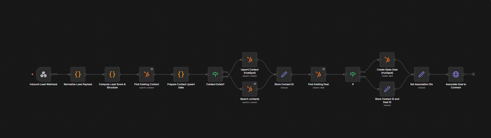

# n8n HubSpot CRM Automation

This project contains an automated CRM workflow built with n8n.

The workflow processes incoming leads, prevents duplicate contacts in HubSpot, and automatically creates deals associated with the correct contact.

---

## Features

- Webhook based lead intake
- Lead normalization and scoring
- Duplicate contact detection
- Contact upsert in HubSpot
- Automated deal creation
- Deal and contact association

---

## Tools Used

- n8n
- HubSpot API
- Webhooks
- JSON data processing

---

## Workflow Overview

1. Receive incoming lead via webhook  
2. Normalize lead payload  
3. Compute lead score  
4. Search existing contact in HubSpot  
5. Upsert contact if needed  
6. Create deal if it doesn't exist  
7. Associate deal with the correct contact  

---

## Workflow Screenshot

---

## Setup

1. Import the `n8n-hubspot-crm-automation.json` file into your n8n instance  
2. Configure your HubSpot API credentials  
3. Activate the workflow  

---

## Author

Shahrear – AI Automation & Workflow Engineering
